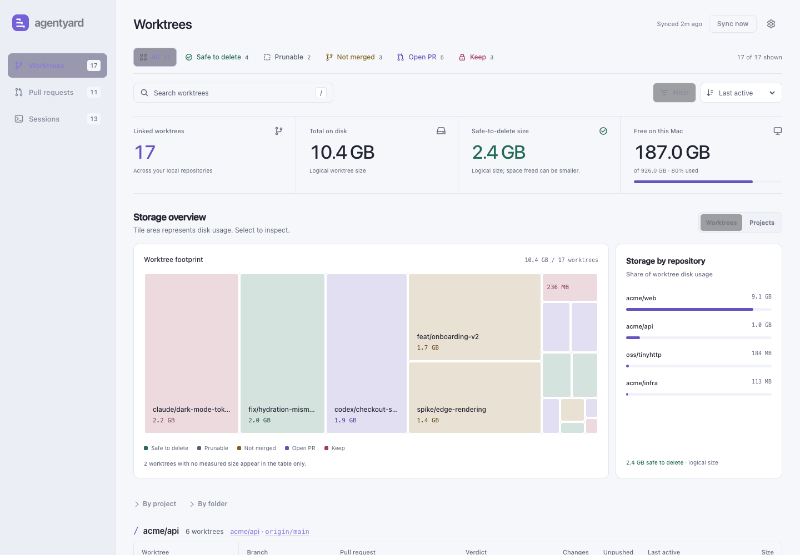
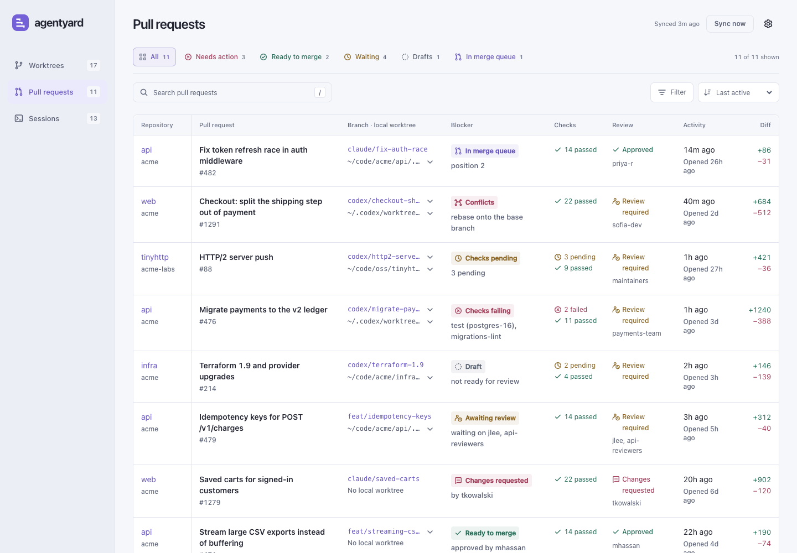
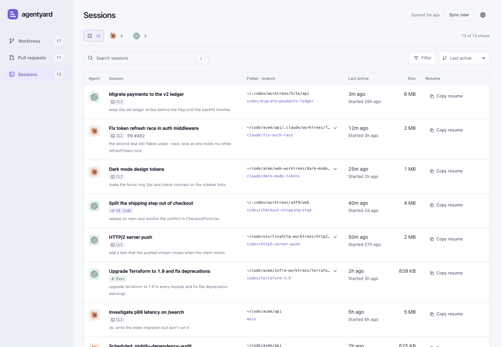
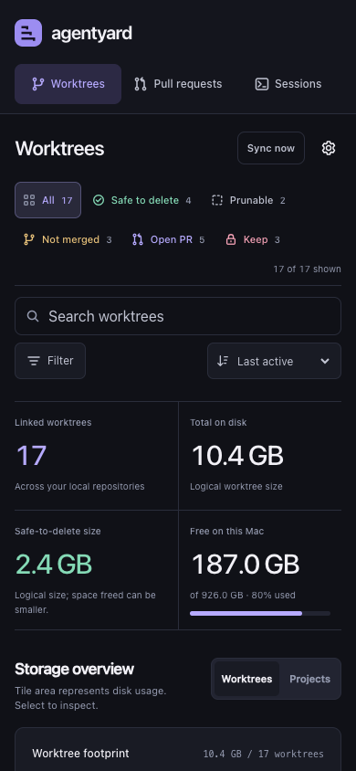
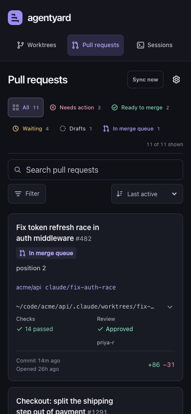

<div align="center">

<picture>
  <source media="(prefers-color-scheme: dark)" srcset="assets/logo-dark.svg">
  
</picture>

### The yard where your coding agents work.

Every git worktree, open pull request and Claude Code / Codex session on one calm page.<br>
One Go binary. No dependencies. Runs quietly in the background on your Mac.

[](https://github.com/MilosMosovsky/agentyard/actions/workflows/ci.yml)
[](https://github.com/MilosMosovsky/agentyard/releases/latest)
[](https://pkg.go.dev/github.com/MilosMosovsky/agentyard)
[](go.mod)
[](LICENSE)
[](#faq)
[](#homebrew)

[Quick start](#quick-start) ·
[Tour](#a-tour) ·
[Install](#install) ·
[Background agent](#run-in-the-background) ·
[Configuration](#configuration) ·
[Privacy](#privacy-and-security) ·
[How it works](#how-it-works) ·
[FAQ](#faq)

<br>

<picture>
  <source media="(prefers-color-scheme: dark)" srcset="docs/screenshots/worktrees-dark.png">
  
</picture>

<sub>Every screenshot here is <code>agentyard demo</code>: synthetic data, nothing from a real machine.</sub>

</div>

## Why

Run ten coding agents in parallel and by Friday you have forty worktrees, a dozen open PRs and a
hundred sessions you cannot find again. Which folders are safe to delete? Which PR is stuck, and on
what? Where was the session that fixed the auth race? agentyard answers all three on one page, and
keeps the answers fresh while you work.

## Quick start

```sh
brew install MilosMosovsky/tap/agentyard
agentyard demo       # the full UI on synthetic data, in two seconds
agentyard install    # run it at login on http://localhost:4777 (asks first)
```

## A tour

### Worktrees

Every 5 minutes agentyard finds each repository under your root folder that has linked worktrees,
fetches it, looks up each branch's pull request, and gives every worktree one verdict:

| Verdict | Meaning |
|---|---|
| **Safe to delete** | PR merged (or HEAD already in the default branch) and the worktree is clean. The only verdict that is safe to delete. |
| **Prunable** | The folder is gone; only git's registration is left (`git worktree prune`). |
| **Not merged** | Clean and pushed, but never merged (closed PR, or no PR). Needs a human decision. |
| **Open PR** | The branch has a PR in review. |
| **Keep** | Uncommitted changes, or commits that exist only on this machine. |

An interactive treemap shows measured disk usage by worktree or repository. Select a tile for its verdict and path, or jump to its row. Search, verdict, and repository filters update the chart, totals, and list together. Choose several values in the Filter menu; remove any selection individually.

Totals are grouped by repository and by folder, with ready-to-copy `git worktree remove` commands for
the safe-to-delete rows. Rows and repositories are sorted by last activity: the newest of the last
commit, the worktree's index and any uncommitted file. Sizes are `du` logical sizes, refreshed every
30 minutes; APFS clones and package-manager hardlinks mean the space you actually free can be smaller.

> [!NOTE]
> agentyard never deletes anything. It prints the commands and leaves running them to you.

### Pull requests

<picture>
  <source media="(prefers-color-scheme: dark)" srcset="docs/screenshots/prs-dark.png">
  
</picture>

Every open PR you authored (`is:pr is:open author:@me archived:false`, as whoever `gh` is logged in
as), newest commit first. Each one gets the single state that decides what happens next, checked in
this order:

| State | Shown when | Detail line |
|---|---|---|
| **In merge queue** | it is queued | its position |
| **Draft** | it is a draft | not ready for review |
| **Conflicts** | it does not merge cleanly | rebase onto the base branch |
| **Checks failing** | any check failed | the failing checks, by name |
| **Changes requested** | a reviewer asked for changes | who asked |
| **Checks pending** | checks are still running | how many |
| **Awaiting review** | a required review is missing | who it is waiting on |
| **Behind base** | the branch is out of date | update the branch |
| **Blocked** | branch protection is not satisfied | |
| **Ready to merge** | none of the above | who approved it |

Next to the state: check counts, review state, last commit, diff size, and the local worktree that has
the branch checked out. Status quick views give one-click access to needs-action, ready, waiting, draft, and queued PRs. The Filter menu combines multiple statuses, organizations, and repositories with search. Active selections can be removed individually; filters and sort order are remembered for the browser session.

### Sessions

<picture>
  <source media="(prefers-color-scheme: dark)" srcset="docs/screenshots/sessions-dark.png">
  
</picture>

Every Claude Code (`~/.claude/projects`) and Codex (`~/.codex/sessions`) session on disk, newest
activity first, with its title (yours, or the one the tool generated), last prompt, folder, branch and
linked PR. Open one for its latest 40 messages. **Copy resume** copies
`cd <folder> && claude --resume <id>` (or `codex resume <id>`), using the folder Claude Code filed the
session under, which is the only place `--resume` finds it. A session whose folder was deleted (say, a
removed worktree) is flagged.

Sub-agents are left out (Codex reviewer and sub-agent rollouts, Claude agent-team workers).
Agent icons identify Claude Code and Codex. Use the agent icons for quick filtering, then narrow by source or folder in the Filter menu. Sort by activity, name, or size.

> [!IMPORTANT]
> Only the Mac running agentyard can open the Sessions tab. Transcripts include tool output, which can
> contain tokens and customer data, so other devices see a notice instead. See
> [Privacy and security](#privacy-and-security).

### On your phone

With [LAN mode](#on-your-local-network) on, the same page works on a phone: tables become cards, and
every target is thumb-sized.

<p align="center">
  
  &nbsp;&nbsp;
  
</p>

**Sync now** (top right) re-runs the worktree scan, the PR poll and the session index right away and
reloads the page when they finish, at most once every 30 seconds. Press `/` to search.

## Install

agentyard needs macOS, `git`, and the [GitHub CLI](https://cli.github.com) logged in
(`gh auth login`). `agentyard demo` needs none of them.

#### Homebrew

```sh
brew install MilosMosovsky/tap/agentyard
```

#### Go

```sh
go install github.com/MilosMosovsky/agentyard@latest   # Go 1.25 or newer
```

#### Install script

```sh
curl -fsSL https://raw.githubusercontent.com/MilosMosovsky/agentyard/main/scripts/install.sh | sh
```

It downloads the latest release for your OS and architecture, checks its SHA-256 against the
release's `checksums.txt`, and puts the binary in `~/.local/bin` (set `AGENTYARD_BIN_DIR` to change
that, or `AGENTYARD_VERSION` to pin one). It installs the binary and nothing else.

#### From source

```sh
git clone https://github.com/MilosMosovsky/agentyard
cd agentyard && go build -o agentyard .
./agentyard demo
```

Release archives for macOS and Linux (amd64, arm64) are on the
[releases page](https://github.com/MilosMosovsky/agentyard/releases).

## Run in the background

```sh
agentyard install
```

It checks your setup, prints exactly what it is about to do, and changes nothing until you say yes:

```console
$ agentyard install
agentyard install

  ✓ git   /usr/bin/git
  ✓ gh    /opt/homebrew/bin/gh, logged in as MilosMosovsky
  ✓ root  ~/Projects
  ✓ port  127.0.0.1:4777 is free

  binary    /opt/homebrew/bin/agentyard
  agent     ~/Library/LaunchAgents/com.github.milosmosovsky.agentyard.plist
  log       ~/Library/Logs/agentyard.log
  root      ~/Projects
  network   this Mac only (127.0.0.1:4777)
  sessions  this Mac only
  url       http://localhost:4777

Install and start in the background at login? [y/N]
```

On yes it writes a per-user LaunchAgent, (re)loads it with `launchctl`, waits until the page answers
and prints the URL. The agent:

- runs `agentyard serve` from the path you installed (the Homebrew symlink, so `brew upgrade` keeps
  working) and starts at login, restarting if it ever exits;
- runs as a background process: low-priority I/O, `nice 10`, and a `GOMEMLIMIT` of 32 MiB;
- gets a `PATH` built from wherever `git` and `gh` live on your Mac;
- logs to `~/Library/Logs/agentyard.log`.

On the first run in a terminal it also asks whether to serve the page to your other devices (default
no). Without a terminal (a script, CI, or ssh with no input) it asks nothing and stops with an error
unless you pass `--yes`. Run it as yourself, not with `sudo`: the agent is per-user, and `install`
refuses to run as root. Without `--root` it uses the first of `~/Projects`, `~/code`, `~/Code`, `~/src`, `~/dev`,
`~/Developer`, `~/repos`, `~/git` or `~/work` that exists.

Re-running `agentyard install` updates the agent in place and keeps your previous settings unless
you pass a flag, so after an upgrade this is all it takes:

```sh
brew upgrade agentyard && agentyard install --yes
```

<details>
<summary><b>See the LaunchAgent before installing</b> (<code>agentyard install --dry-run</code>)</summary>

`--dry-run` runs the same checks, prints the same plan, then shows the plist it would write and
changes nothing:

```xml
<?xml version="1.0" encoding="UTF-8"?>
<!DOCTYPE plist PUBLIC "-//Apple//DTD PLIST 1.0//EN" "http://www.apple.com/DTDs/PropertyList-1.0.dtd">
<plist version="1.0">
<dict>
    <key>Label</key>
    <string>com.github.milosmosovsky.agentyard</string>
    <key>ProgramArguments</key>
    <array>
        <string>/opt/homebrew/bin/agentyard</string>
        <string>serve</string>
        <string>-root</string>
        <string>/Users/you/Projects</string>
        <string>-listen</string>
        <string>127.0.0.1:4777</string>
        <string>-mdns</string>
        <string></string>
        <string>-claude-dir</string>
        <string>/Users/you/.claude</string>
        <string>-codex-dir</string>
        <string>/Users/you/.codex</string>
        <string>-sessions-lan=false</string>
    </array>
    <key>EnvironmentVariables</key>
    <dict>
        <key>PATH</key>
        <string>/opt/homebrew/bin:/usr/bin:/bin:/usr/sbin:/sbin</string>
        <key>GOMEMLIMIT</key>
        <string>32MiB</string>
    </dict>
    <key>RunAtLoad</key>
    <true/>
    <key>KeepAlive</key>
    <true/>
    <!-- Scans run git and du over every worktree; keep them out of the way. -->
    <key>ProcessType</key>
    <string>Background</string>
    <key>LowPriorityIO</key>
    <true/>
    <key>Nice</key>
    <integer>10</integer>
    <key>StandardOutPath</key>
    <string>/Users/you/Library/Logs/agentyard.log</string>
    <key>StandardErrorPath</key>
    <string>/Users/you/Library/Logs/agentyard.log</string>
</dict>
</plist>
```

</details>

### On your local network

```sh
agentyard install --lan                    # http://agentyard.local on port 80
agentyard install --lan --name yard-ana    # someone else on the network already has agentyard.local
agentyard install --lan --port 8080        # port 80 is taken: http://agentyard.local:8080
agentyard install --lan=false              # back to this Mac only
```

With `--lan` it listens on `:80` and publishes `<name>.local` over Bonjour (`dns-sd`), so your phone
and laptop can open it. Preflight checks that the port is free and that no other host already answers
to that name. The Sessions tab stays on this Mac unless you also pass `--sessions-lan`.

### Day to day

```console
$ agentyard status       # loaded? pid, root, network, URL, version, last scan, log path
$ agentyard open         # open the dashboard in your browser
$ agentyard uninstall    # stop it and remove the LaunchAgent
```

`uninstall` asks `Remove the background agent? [y/N]`, then tells you what it left behind: the cache
in `~/Library/Caches/agentyard` and the log.

Removing a Homebrew install? Stop the agent first, or launchd keeps trying to start a binary that is
gone: `agentyard uninstall && brew uninstall agentyard`. `brew uninstall --zap agentyard` also
removes the agent, the cache and the log.

## Configuration

```console
$ agentyard help
agentyard — the yard where your coding agents work.
Every git worktree, open PR and Claude Code / Codex session on one calm page.

Usage:
  agentyard <command> [flags]

Commands:
  demo        try it on synthetic data (reads nothing on this Mac)
  install     run it in the background at login (macOS LaunchAgent)
  status      is the background agent running, and where to find it
  open        open the dashboard in your browser
  uninstall   stop the background agent and remove it
  serve       run the dashboard in the foreground
  version     print the version
  help        show this help

Run "agentyard <command> -h" for a command's flags.
```

Flags take one dash or two (`-root` and `--root` are the same).

#### `agentyard install`

| Flag | Default | |
|---|---|---|
| `--root DIR` | previous install's, else the first common code folder that exists | folder holding your repositories |
| `--lan` | off | serve on your local network as `http://<name>.local`; `--lan=false` turns it off again |
| `--name NAME` | `agentyard` | with `--lan`: the `.local` name to publish |
| `--port N` | `4777`, or `80` with `--lan` | port to listen on |
| `--sessions-lan` | off | with `--lan`: show the Sessions tab to other devices too |
| `--yes` | | don't ask; install with these settings |
| `--dry-run` | | show the checks, the plan and the plist; change nothing |

`install` reads `CLAUDE_CONFIG_DIR` and `CODEX_HOME` if you have set them, and passes `GH_CONFIG_DIR`
and `XDG_CONFIG_HOME` on to the agent so `gh` finds its login. Tokens are never written to the
LaunchAgent: a login that exists only as `GH_TOKEN` or `GITHUB_TOKEN` in your shell fails preflight,
because launchd does not read your shell profile. Run `gh auth login` instead.

#### `agentyard serve`

What the background agent runs. Use it directly to run in the foreground, or under another service
manager.

| Flag | Default | |
|---|---|---|
| `-root DIR` | `~/Projects` | folder to search for repositories |
| `-depth N` | `5` | max folder depth below `-root` to look for repositories |
| `-listen ADDR` | `127.0.0.1:4777` | HTTP listen address (`:80` serves the whole LAN) |
| `-mdns NAME` | off | publish as `http://<name>.local` over mDNS (ignored on loopback) |
| `-interval D` | `5m` | rescan interval for worktrees, PRs and sessions |
| `-size-ttl D` | `30m` | how long a measured worktree size is reused |
| `-claude-dir DIR` | `~/.claude` | Claude Code config folder (holds `projects/`) |
| `-codex-dir DIR` | `~/.codex` | Codex home folder (holds `sessions/`) |
| `-sessions-lan` | off | serve the Sessions tab to other devices too |
| `-once` | | scan once, print the worktree JSON to stdout and exit |

`agentyard demo` takes `-listen` (default `127.0.0.1:4777`; if that port is busy and you did not pass
`-listen`, it picks a free one) and `--no-open`. `agentyard version` prints the version.

#### JSON

The page's data is also served as JSON: `/api.json` (worktrees), `/api/prs.json` (pull requests) and
`/api/status` (version, last scan times, whether a sync is running).

## Privacy and security

agentyard is a local tool with no login and no telemetry. It talks to GitHub through your existing
`gh` login and stores no tokens.

- **By default only this Mac can reach it** (`127.0.0.1:4777`).
- **LAN mode is opt-in.** Even then, only loopback, private and link-local addresses are answered;
  anything else gets a 403. That is a filter, not authentication: anyone on your network can see
  branch names, PR titles and repository names. Don't use LAN mode on shared or public Wi-Fi.
- **Sessions stay on this Mac.** Other devices see a notice and no session ids, unless you opt in with
  `--sessions-lan`.
- **Sync** refuses cross-origin requests, so another web page cannot trigger scans.
- **Only its own names are answered.** Requests must address it as `localhost`, an IP address, its
  `.local` name or this Mac's host name; any other `Host` gets a 403. That stops DNS rebinding, where a
  web page re-points its own domain at `127.0.0.1` to read the dashboard.
- **Read-only.** It never deletes worktrees or branches and never writes to your repositories. The
  one thing it runs that touches them is `git fetch --prune`.

Found a vulnerability? Please report it privately; see [SECURITY.md](SECURITY.md).

## How it works

```
every 5 minutes, or on Sync now
  worktrees   git worktree list → git fetch → status, unpushed → PR lookup → verdict
  PRs         gh GraphQL → checks, reviews, merge state → blocker
  sessions    transcript head + tail → title, last prompt, folder, branch → index
                                        ↓
              one embedded page, plus JSON, served by one binary
```

- **Scanning.** It walks `-root` (up to `-depth` levels) for repositories with linked worktrees and
  runs `git` in each. `du` sizes are measured at most every 30 minutes per worktree.
- **Fetching safely.** Each repository with worktrees is fetched (`git fetch --prune`) so `origin/*`
  refs stay current and deleted remote branches disappear without you running anything. GitHub
  repositories are fetched over HTTPS with gh's credentials. Every git call runs with
  `GIT_OPTIONAL_LOCKS=0`, `--no-write-fetch-head` and automatic gc and maintenance off, so it never
  fights a commit an agent is making in the same worktree. A failed fetch is retried twice (after 10
  and 30 seconds), which rides out VPN reconnects.
- **GitHub API cost.** One GraphQL query pages through your PRs 20 at a time: about 1 point per 20
  PRs per poll, so about 7 points every 5 minutes for 120 PRs, out of the 5,000 an hour GitHub
  allows. Failing check names are fetched only for PRs that have failures. Polling pauses while
  fewer than 300 points remain.
- **Sessions without reading transcripts.** Each transcript is read as a 128 KB head and a 512 KB
  tail, and only again when the file changes. Opening a session reads just enough of its end for the
  latest 40 messages.
- **Caches.** The last worktree scan, PR poll and session index are kept in
  `~/Library/Caches/agentyard/`, so a restart serves the page at once without asking GitHub again or
  re-measuring disk.

## FAQ

<details>
<summary><b>Does it delete anything?</b></summary>

No. It shows a verdict and the exact `git worktree remove` command for the safe-to-delete rows, and
you decide. The only command it runs against your repositories is `git fetch --prune`.
</details>

<details>
<summary><b>Port 80 is already in use.</b></summary>

Preflight tells you, with the `lsof` command that shows who has it. Pick another port:
`agentyard install --lan --port 8080`, then open `http://agentyard.local:8080`. Without `--lan`,
agentyard uses port 4777 and never needs 80.
</details>

<details>
<summary><b>Someone else on my network already uses agentyard.local.</b></summary>

Preflight checks for that. Choose your own name with `agentyard install --lan --name yard-ana`.
</details>

<details>
<summary><b>The page says it is still scanning.</b></summary>

The first scan fetches every repository with worktrees, so on a large `~/Projects` it can take a
minute. The page fills itself in. `agentyard status` shows when the last scan finished, and the log
is at `~/Library/Logs/agentyard.log`.
</details>

<details>
<summary><b>How much does it cost to keep running?</b></summary>

One small process, capped at a 32 MiB soft memory limit, at background priority. It does real work
once every 5 minutes and sleeps in between.
</details>

<details>
<summary><b>Why macOS first? Does it run on Linux?</b></summary>

The background agent is a launchd LaunchAgent and the `.local` name comes from Bonjour's `dns-sd`,
both macOS. The dashboard itself is portable Go: on Linux, `agentyard serve` and `agentyard demo` work
(release archives are built for Linux too), and you can run `serve` under systemd or any service
manager. `install` and `uninstall` say they are macOS only.
</details>

<details>
<summary><b>Why does it need the GitHub CLI?</b></summary>

`gh` is how it finds your PRs and fetches over HTTPS without its own credentials. There is no token
to paste and nothing to configure. The PR list is simply whoever `gh` is logged in as.
</details>

<details>
<summary><b>Can I script against it?</b></summary>

`agentyard serve -once` prints one worktree scan as JSON and exits, and a running agentyard serves
`/api.json`, `/api/prs.json` and `/api/status`.
</details>

## Contributing

agentyard is deliberately small: one Go binary using only the standard library, and one embedded
HTML page with no build step. Issues and pull requests are welcome; see
[CONTRIBUTING.md](CONTRIBUTING.md). For UI changes, take screenshots from `agentyard demo`, never from
your real repositories.

```sh
go build -o agentyard . && ./agentyard demo
go vet ./... && go test -race ./...
```

## License

[MIT](LICENSE)
